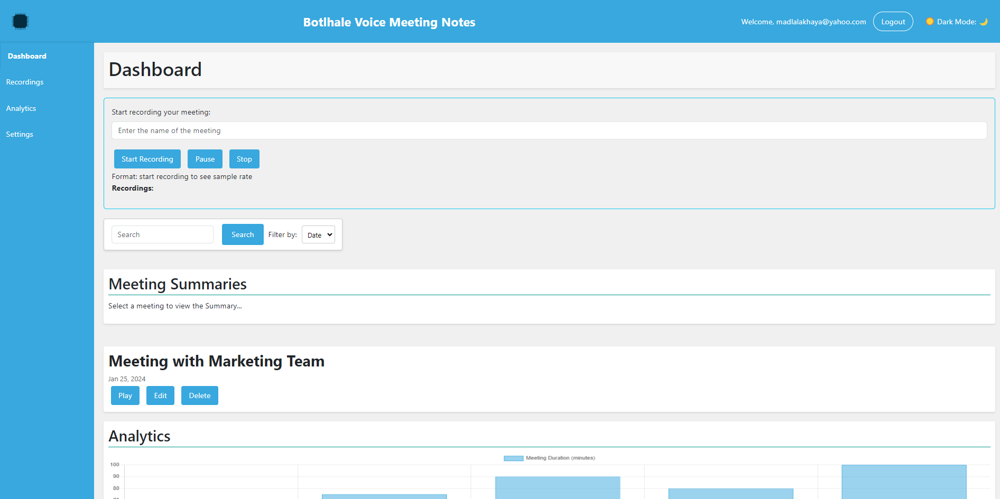

<h1 align="center"><b>This is red text</b></h1>

TranscriptForge revolutionizes meeting productivity with AI-driven audio transcription and note-taking. Seamlessly capture discussions, organize notes, and highlight action items effortlessly.
Overview

TranscriptForge is your indispensable tool for transforming mundane meetings into efficient, action-oriented sessions. Designed to cater to professionals and teams seeking to optimize their workflow, TranscriptForge offers advanced features to simplify meeting management and enhance productivity.
Features

    Seamless Audio Recording: Initiate high-quality recordings with a single click.
    Intelligent Transcription: Harness the power of AI to convert speech into precise text.
    Speaker Identification: Automatically differentiate and label speakers for clarity.
    Instant Summaries: Generate concise summaries for quick review and reference.
    Actionable Insights: Easily identify and track action items and decisions.
    User-Friendly Interface: Navigate effortlessly through a sleek and intuitive dashboard.

   

## How It Works

Your Meeting App keeps track of discussions and action items in real-time, providing you with a centralized platform to manage your meetings. Here's how it works:

- **Seamless Recording:** Initiate recordings with a single click.
- **Intelligent Transcription:** Convert speech into accurate text using AI technology.
- **Speaker Identification:** Automatically label speakers for clarity.
- **Summarization:** Generate concise summaries for quick review and reference.
- **Action Item Tracking:** Easily identify and track action items and decisions.
- 
## QUICK START
    -- Clone or Download: Obtain the repository by cloning it or downloading the ZIP file.
    -- Install Dependencies: Ensure all necessary dependencies are installed.
    -- Run the Application: Launch the application to access the user-friendly dashboard.
    -- Start Recording: Initiate recordings with a click and let TranscriptForge handle the rest!

## How to Contribute
We welcome contributions from the community! Whether you're fixing bugs, adding features, or improving documentation, your input is invaluable. Simply send us a pull request, and let's make TranscriptForge even better together.
Questions? Suggestions? We'd love to hear from you! Reach out to us directly or join our vibrant community forum. Your feedback is essential to our ongoing improvement efforts.

## Getting Started

    Installation:
        Download the TranscriptForge application from the provided repository.
        Install any required dependencies as outlined in the Requirements.txt file.
    Running the Application:
        Launch the application to access the intuitive dashboard.
        Follow the prompts to log in or create a new account.
    Navigation:
        Utilize the dashboard to access features such as 'Record a Meeting' or 'Meeting Summaries'.
        Familiarize yourself with search and filter options to locate past meetings efficiently.

Recording a Meeting

    Starting a Recording:
        Click the 'Record a Meeting' button and grant necessary microphone permissions.
        Enter a name for the meeting to initiate recording.
    During the Meeting:
        Utilize the 'Pause' button to temporarily halt recording, if required.
        Click 'Resume' to continue recording seamlessly.
    Saving a Recording:
        Press 'Stop' to end the session.
        The recording will be automatically saved and transcribed.

Reviewing Transcripts

    Access the 'Meeting Summaries' section from the dashboard.
    Select a meeting to view its detailed transcript.
    Utilize the search function within the transcript for quick navigation.

Accessing Summaries

    Summaries are conveniently available alongside transcripts for each recorded session.
    Review summaries to capture key points and decisions made during the meeting.

Troubleshooting

    Common Issues:
        Ensure microphone permissions are granted if encountering problems with audio recording.
        For transcription errors, check for background noise and speak clearly.
        Verify storage permissions and designated folders if recordings appear to be missing.

## Tech

transcritForge is part one of [Botlhale AI](https://botlhale.ai/) platforms. Its UI is written in CSS using Javascript and its backend is written in [Python Flask Framework](https://www.python.org/).
